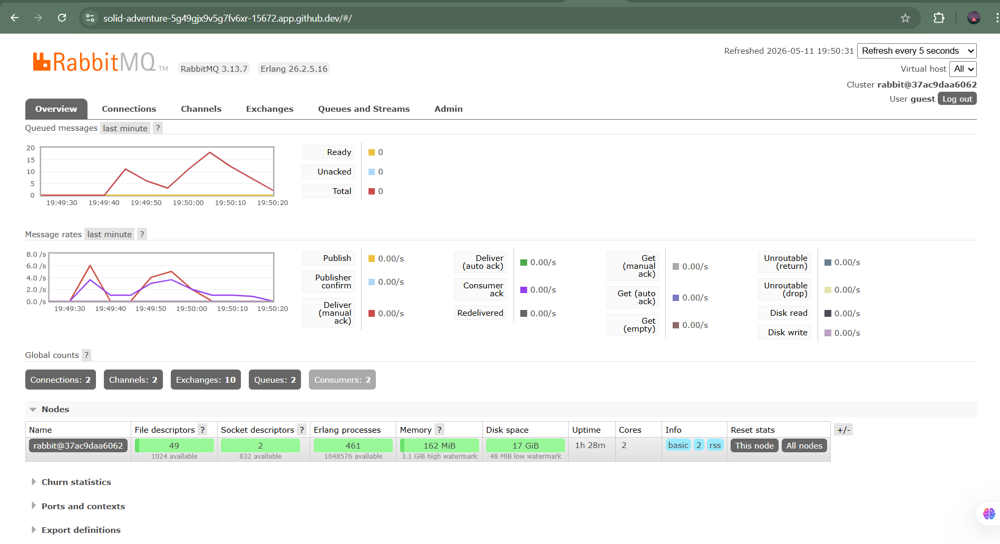

a. Apa itu AMQP?

AMQP (Advanced Message Queuing Protocol) adalah protokol komunikasi standar yang digunakan untuk message broker. Protokol ini mendefinisikan bagaimana pesan dikirim, diterima, dan dikelola antar aplikasi melalui perantara yang disebut broker. AMQP menjamin pengiriman pesan yang andal (reliable) serta mendukung fitur seperti antrian (queue), routing, dan berbagai pola pengiriman pesan.

b. Apa arti `guest:guest@localhost:5672`?

Format tersebut adalah connection string untuk terhubung ke RabbitMQ. `guest` pertama merupakan username, sedangkan `guest` kedua adalah password yang digunakan untuk autentikasi. `localhost:5672` menunjukkan alamat host dan port tempat RabbitMQ berjalan. Port `5672` merupakan port default yang digunakan oleh protokol AMQP.

## Simulation Slow Subscriber

Jumlah antrian menumpuk karena setiap kali publisher dijalankan, 5 pesan
langsung dikirim sekaligus. Subscriber yang dibuat lambat (delay 1 detik
per pesan) tidak mampu memproses pesan secepat publisher mengirimkannya.
Akibatnya pesan-pesan tersebut mengantri di RabbitMQ. Jika publisher
dijalankan 4 kali, ada 20 pesan dikirim, tapi subscriber hanya memproses
1 per detik.

Ini adalah keunggulan event-driven architecture: meski subscriber lambat,
sistem tidak crash. Pesan tersimpan aman di antrian dan akan diproses
satu per satu sesuai kapasitas subscriber.